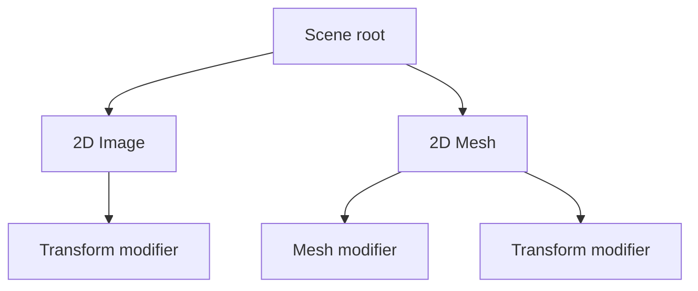
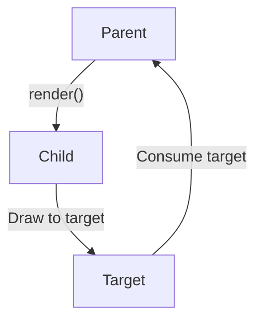
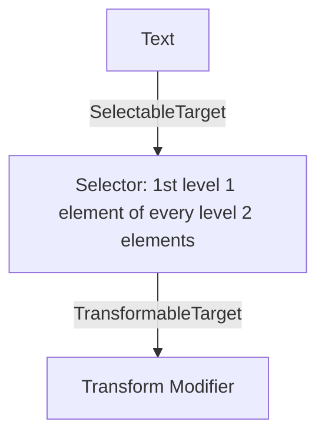
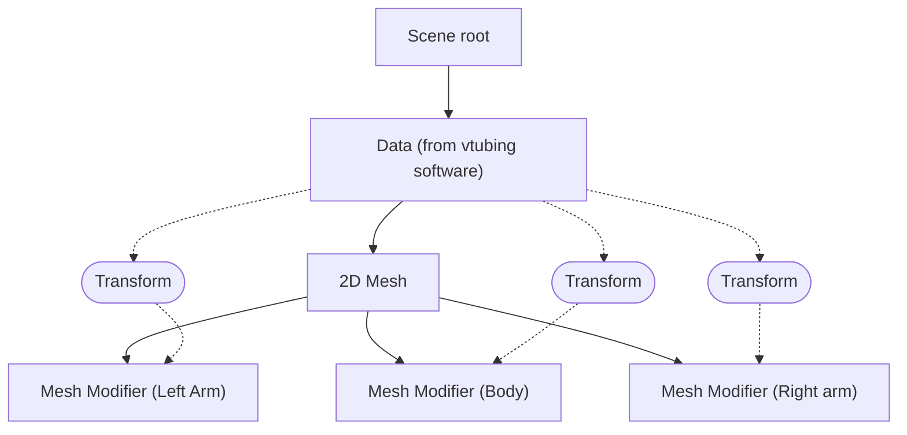
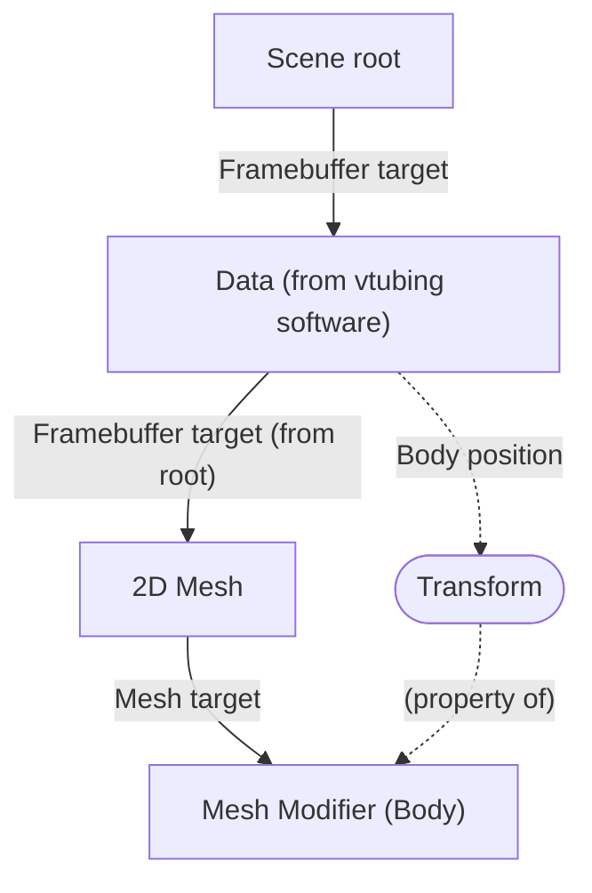

I have been working on Nahara's Motion for the past several weeks, not because I want it to be the best motion graphics
editor of all time, but because I want to use the motion graphics editor that is designed just for me. I know what I
want best, and if no one is fulfilling my need, I will do it myself.

> "The game made for everyone is the game made for no one."

Also I am too broke for expensive motion graphics editors, but that's a different story.

## Scene system

The scene system in Nahara's Motion is essentially like a tree in computer science world. The root node (which is the
scene) connect to multiple nodes, and each node can connect to other nodes as well.



The only limitation is the objects cannot have circular dependency, so if an object whose set of descendant contains
itself, the entire scene would become invalid, but that's pretty much about it. Connecting **Mesh modifier** to
**2D Image** is totally legal, but it wouldn't do anything, and we will talk about this kind of object incompatibility
later.

The representation of this scene system in data structure is pretty simple. Each object have its own identifier, which
can be an unique 36-character long UUID (or 128-bit integer for efficiency), or in some cases, a pointer pointing to the
object's data.

```typescript
type Id<T> = string & { _brand?: T }

interface Scene {
    children: Id<SceneObject>[]
}

interface SceneObject {
    children: Id<SceneObject>[]
}
```

Actually, the TypeScript code above is still incomplete. In fact, the `Scene` interface is still missing the most
important piece of data, which is the data for all objects in the scene, otherwise we don't know what data associated
with `Id<SceneObject>`. So extending the code above, you'd need a new `objects` field:

```typescript
interface Scene {
    objects: Map<Id<SceneObject>, SceneObject>
}
```

But how does an object know its type? We need to extend `SceneObject` to store other object-specific information so that
the renderer knows how to render the objects:

```typescript
interface SceneObject {
    typeId: Id<ObjectType>
    state: unknown
}
```

`typeId` references an object type that implements the rendering functions and other things needed to render the object,
and `state` holds the state that the object type needed to render the object. So when rendering the object, the scene
renderer would pass the content of `state` to renderer defined in `ObjectType`, like this:

```typescript
interface ObjectType {
    renderObject(state: unknown)
}

// Inside scene renderer: Rendering an object
const object: SceneObject
const type = lookupTypeById(object.typeId)
type.renderObject(object.state)
```

> The actual rendering process is much more complicated than just calling `renderObject()`. We will describe the scene
> rendering process later.

To recap: we've created a simple scene system based on tree data structure, where each object is a node in the scene. We
also described the basic components of an object, which consists of reference to object type, the state for rendering
and list of references to children. We defined one single hard rule for all the scenes, which is circular dependency is
not allowed.

## Render target

To actually render the object, the renderer need to know where it should render the content. "Render" implies the engine
would draw the pixels to framebuffer, but in Nahara's Motion, it's more than just graphics. When we say "render", we
mean "mutating the state of an object", and we call the object that is being mutated "render target".

To render something, the parent first create render targets, then pass the target down to all children. From child's
perspective, it can skip rendering to target if the type doesn't match what it is expecting (basically do nothing), or
mutate the state of target if the targte matches with expected type. Once the rendering is done, the parent will collect
the state that was mutated and determine what to do next, like transfering content from framebuffer to screen for
example.



This kind of rendering allows child object to act as modifier, which are objects that can directly affect the parent,
like translating the parent object for example. In Nahara's Motion, any child object that directly influence the parent
are called "modifier".

It is worth mentioning that parent doesn't have to render the children at all. In fact, the parent object can call
`render()` how many times it wanted to, including not calling at all, or calling multiple times. This is why the
children can do nothing if the render target type is invalid, or render when the type is correct, as it is possible that
the parent want to pass multiple targets to children, such as passing transformable target and then framebuffer target.

### Selectable target

Complex object with multiple parts may have some of the parts be modified independently from each other. For example, a
text object consists of multiple words and characters, and you want to scale the first character of each word by 120%.
In order to apply transform modifier only on those characters, you would have to tell the text object that you only want
to affect those parts, and then the parent would pass new render targets that only affect the selected parts.



The concept of selectable target can be modeled like the TypeScript types below:

```typescript
interface SelectableTarget extends RenderTarget {
    targetsFor(selection: Selection): Iterable<RenderTarget>
}

// Select a range of elements
// This is much more simplified than the actual `Selection` interface, which
// also concerns with step size and selecting parts with percentages.
interface Selection {
    level: number
    start: number // inclusive, use -Infinity to select from the start
    end: number // exclusive, use +Infinity to select to the end
    each: Selection | null
}
```

So from example, if we want to select the first character of every single word, we would have to create a selection
that select all words first, then inside each word, we select only the first character, like this:

```typescript
const selection: Selection = {
    level: 2, // We select all words...
    start: -Infinity,
    end: Infinity,
    each: { // ...then for each word...
        level: 1, // ...we only select the first character
        start: 0,
        end: 1,
        each: null
    }
}
```

And to actually scale the character up, we would have to obtain the render targets that are associated with our
selection:

```typescript
const target: SelectableTarget

target.targetsFor(selection, target => {
    renderChildren(target) // pass it to modifier
})
```

## Render environment

Render environment is a collection of resources that the renderer can access. We have to specify the environment that
the scene will be rendered into, because each type of media can only be processed in its own thread, and accessing
resources from other threads is not a good idea (unless you rely on lock mechanism, but that would slow down the render
speed).

Nahara's Motion defines 3 different type of render environments:

- **Graphics**: The main render environment. As the name implied, this environment is for rendering graphics. This
  environment provides the handles for GPU device, textures, command queues and resources needed to render graphics.

- **Audio**: This environment is for producing audio, so it must provides the circular buffer for writing audio samples
  and resources needed to produce sound waves to your speaker.

- **Editor**: A special render environment that only exists inside editor. Objects would "render" to the editor-related
  targets to provide editor functionalities.

In case the object renderer does not support a specific environment (eg: trying to render graphics object inside audio
environment), the parent object should just be always passing the render target to children from parent as-is. If the
object produce any outputs for children to consume, the renderer should be "implemented" for unsupported environment to
provide the outputs anyways, otherwise there would be discrepancies between different environments, thus making the
property linking "weird".

## Data flow

Usually in motion graphics, an object can have its properties linked to other objects in the scene. One example is
linking the position of an image to the last character of text object.

In most motion graphics editors, the property can be linked by specifying the expression, which references one or
multiple foreign objects in the scene. The disadvantage of this method is it introduces the possibility of having
circular dependency, which is when an object depends on its own output, whether directly or indirectly. One quick
solution is to just set the value to zero when circular link is detected, but we can do better than this.

Using the scene tree system, we can enforce the flow of data to one direction, effectively killing the potential for
circular links, which is by only letting the object access output values from ascendants, but not letting any ascendants
or objects outside the tree from accessing the output values of that object.

For example, given the following scene for a vtuber model with the following objects:

- An image of vtuber model in T-pose position
- Mesh modifiers to apply mesh deformation on vtuber image
- Data collected from puppeting/vtubing software (eg: data coming from trackers)

To control the vtuber model from puppeting software, the image need to be deformed according to data coming from that
software, which is handled by mesh modifiers. Each mesh modifier is associated with data field from **Data** object, as
seen from the graph below.



Okay, that's a bit hard to look at. Let's take a look at just body part for now:



In order to control the body part of the 2D mesh object based on data coming from body tracker, you'd have to use mesh
modifier whose transformation linked to data provider. To access data from data provider, the mesh modifier must be the
descendant of data provider. The data provider cannot access the output of 2D mesh, and 2D mesh cannot access the output
of mesh modifiers. Mesh modifiers, on the other hand, can access the properties of data provider, because it is the
descendant of data provider. And if we go back to the first graph, the mesh modifier for left arm cannot access the
output of any other mesh modifiers, because it is not the descendant. Same thing goes for any other mesh modifiers. And
because of this one-way data flow direction, circular link is impossible.

## Concerns

### Why not using node-based scene system?

It is true that node graph systems are much more powerful than tree-based systems, but we choose tree-based system
anyways because it can be quite hard to understand node-based system for most people. Also, it is pointless for us to
pick node-based system anyways, as there are projects like [Graphite][graphite] or [Blender][blender] that can do motion
graphics using nodes.

### There are other motion graphics editors out there, why do you want to make a new one?

Because I am not happy with existing tools.

Allow me to explain: I have evaluated all possible options for doing 2D motion graphics, which includes
[Blender][blender], [Graphite][graphite], [Friction][friction] and more.

- [**Blender**][blender]: It is designed for 3D only, but it's also possible to do 2D motion graphics with it (in fact,
  it is the most powerful tool out of everything I've tried). It's just that everything requires a lot more work to do
  motion graphics for 2D.

- [**Friction**][friction]: It is tree-based motion graphics editor, just like Nahara's Motion, but I personally find it
  quite unintuitive to use. I wish the expression editor would have more advanced code suggestion, like yeah I can write
  JavaScript without code suggestion just fine, but for complex expressions, it is a bit annoying to write. It also
  doesn't support 2D mesh from what I've seen, which is one reason for me to consider writing Nahara's Motion.

- [**Graphite**][graphite]: It is powerful... _if_ you know what you are doing. The thing with node editor is that it is
  confusing to use in general in my personal opinion. Or it is confusing because I was trying to use it like Blender
  geometry node, so yeah, maybe I should have read the documentations. Oh well...

  I just can't pin down the reason why it is weird to use really.

- **After Effects**: It is expensive... Also I don't know if I want to trust the big A with my money. All I want is
  motion graphics editor so I can do motion graphics as a hobby, and I am not making a living with motion graphics, so
  what's the point of investing in getting After Effects?

- **Davinci Resolve Fusion**: Also node-based, but it is more on visual effects than motion graphics. I tried to make
  some vector animations with it, yeah it works fine but it's also not the best for doing vector animations. I can see
  professionals using this in post-production though.

- **Calvary**: It would have been awesome if I can even login into it. Neither my GNU/Linux machine (through Wine layer)
  nor my Windows 11 VM can login into Calvary. I might as well just give up trying.

Okay, maybe I've been complaining quite a lot, but really, I just want to do motion graphics, but the features that I am
asking for might be way too much, so I might as well make my own editor and see how far I can go, but basically, here
are the features that I want to use:

- 2D mesh animation, kinda like Blender armature
- Combining vector graphics with shader effects
- GPU-acceleration
- Additional 3D mode (it should be pretty basic though, otherwise I can just use Blender)
- Nice to use (I have my own UX design in mind)
- External usage outside the editor: vtubing, interactive websites, or maybe an animated companion on a small
  touchscreen

### Is Nahara's Motion going to be free?

Free in [freedom][fsf] or free in free beer? Either way, it is always a yes.

It wouldn't be wrong if I choose to sell Nahara's Motion for a little bit of money. After all, I spent so much time on
architecturing, experimenting and implementing this tiny little motion graphics editor. In fact, if we understand the
word "free" in "free software" as freedom, selling the software is entirely legal and encourged.

But after seeing so many people complained that their account got deactived by the big A, especially right after they
bought the full year subscription, I have decided that it would be better if everyone can use and own this software for
no cost. You can find me and buy me a cup of coffee, but it is not a requirement to use this software. I also hate
software subscriptions as well, so this is basically me eating my own words.

[graphite]: https://graphite.art
[blender]: https://blender.org
[friction]: https://friction.graphics
[fsf]: https://fsf.org
